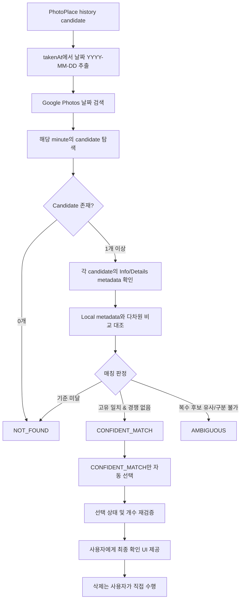

# Ghost Photo — Feasibility 검증 결과 및 기술 아키텍처 보고서

> **최종 판정**: `Promising / technically plausible`  
> **핵심 원칙**: `FALSE POSITIVE = 0` (오선택 0건 절대 보장, 삭제 자동화 제외)

---

## 1. 현재까지 검증된 것

### Google Photos 접근 / 탐색
- 실제 Android 실기기(`SM-F971N`, Galaxy Z Fold)에서 Google Photos UI를 UIAutomator / Accessibility Tree로 정밀 탐색 가능.
- Google Photos 검색 탭에서 `YYYY-MM-DD` 날짜 검색이 완벽하게 동작하여 특정 일자의 미디어 후보군을 즉시 필터링 가능.
- 검색 결과 및 타임라인에서 사진(`~에 촬영한 사진`)과 동영상(`~에 촬영한 동영상`) 노드를 명확히 분별 가능.
- 메인 그리드 및 검색 결과 접근성 트리의 `content-desc`를 통해 촬영 날짜와 분 단위 시간(`YYYY. M. D. [오전/오후] H:MM`) 확인 가능.

### 선택 안전성 (Selection Mechanics)
- 대상 타일 800~1000ms 롱프레스(Long-press)로 멀티 선택 모드(Multi-select Mode) 진입 가능.
- 이후 타겟 노드를 단일 탭하여 추가 선택/해제 토글 가능.
- 접근성 노드의 `checked="true/false"` 속성을 통해 실제 선택 여부를 100% 프로그램적으로 검증 가능.
- 상단 플로팅 바(`floating_selection_count`)의 `text="N"`, `content-desc="N개 선택됨"`을 통해 총 선택 개수 실시간 재검증 가능.
- **제품 범위 확정**: "지정 후보 선택 → 실제 선택 상태 검증 → 사용자에게 넘김" 흐름의 기술적 가능성이 확인됨. **삭제/휴지통 동작은 제품 자동화 범위에 일절 포함하지 않음(사용자 수동 확인/삭제).**

---

## 2. Identity Matching에서 확인된 것

### Grid-level matching의 한계와 규칙 폐기
Google Photos 메인 그리드 및 검색 결과 그리드에서는 기본적으로:
- 날짜
- 분 단위 촬영시간
- 이미지/동영상 타입

정도만 확인 가능하다. 초 단위 시간, 원본 파일명, 해상도, 파일 크기는 그리드 접근성 노드에 노출되지 않는다.

따라서:
- **`takenAt minute` 단독 일치만으로 동일 사진임을 확정할 수 없다.**
- 같은 1분 안에 여러 사진이 존재(연사/다중 촬영)할 수 있다.
- Cloud에 타겟 A가 없는데(로컬 삭제 후 미백업 등), 우연히 같은 분에 찍힌 다른 사진 B만 Cloud에 존재하는 경우 **B를 A로 오인하여 선택하는 치명적 False Positive(오선택)**가 발생할 수 있다.

**👉 폐기된 규칙:**
1. `unique minute == exact identity` (폐기)
2. `local에서도 그 분에 한 장 + cloud에서도 한 장 == exact match` (폐기, identity proof가 아님)

---

## 3. Info / Details Metadata 검증

실제 Google Photos 사진의 Info/Details(세부정보) 화면에서 Accessibility Tree를 통해 다음 metadata가 노출되는 것을 확인했다:

- **파일명 (`filename`)**: 예: `adv_live_timeline.png`, `20260829_190149.jpg`
- **해상도 (`width x height`)**: 예: `1248 x 1972`, `4080 x 3060`
- **표시 파일 크기 (`file size`)**: 예: `백업됨 • 2.8MB`, `백업됨 • 7.7MB` (MB 단위 반올림)
- **촬영 일시**: `2026년 8월 29일 (토) • 오후 7:01` (분 단위)
- **기타 정보**: 촬영 기기(`samsung Galaxy Z Fold8`), 화질(`원본 화질`), 장소/위치(`서울특별시` 등)

따라서 향후 identity matching은 단일 값이 아니라 **여러 metadata를 다차원 조합하여 판단**한다:

```text
[Local PhotoPlace Record]            [Google Photos Candidate]
- takenAt (ms / YYYY-MM-DD HH:mm:ss) ───► date / minute
- filename (_display_name)           ───► filename
- width / height                     ───► width / height
- size (bytes)                       ───► displayed size (MB)
- mediaType (image/video)            ───► mediaType
- optional (device, location)        ───► optional (device, location)
```

---

## 4. 현재 권장 Matching Pipeline



> **절대 원칙**: Confidence가 부족하거나 모호한 후보는 절대 추측하여 선택하지 않고 `AMBIGUOUS`로 안전 배제한다.

---

## 5. 아직 검증되지 않은 것

### A. Filename / Resolution consistency
- 이전 Info 실험에서는 `filename`과 `width/height`가 노출되었으나, 위치/지도 정보가 포함된 사진의 경우 RecyclerView 스크롤 상태에 따라 파일명이 뷰포트 하단에 위치할 수 있음.
- 기존 dump 및 구조를 분석하여 파일명/해상도가 모든 사진 유형에서 안정적으로 노출/추출되는지 확인 필요.

### B. Candidate traversal completeness (순회 완전성)
- 현재 일부 target은 `NOT_FOUND`였으나, 실제로 Cloud에 존재하지 않는 것이 아니라 현재 화면 뷰포트(Viewport)에서 발견하지 못한 경우가 존재함.
- 날짜 검색 결과 전체를 누락/중복 없이 안정적으로 스크롤 순회할 수 있는 메커니즘 검증 필요.
- `NOT_FOUND`는 검색 결과의 마지막 candidate까지 완전 탐색을 완료한 후에만 확정해야 함.

### C. Metadata collision
- Same minute + Same filename + Same resolution + 유사 file size 등 극단적 충돌 시의 정책 정의.
- 모든 metadata가 충분히 구별되지 않으면 반드시 `AMBIGUOUS`로 남김.

---

## 6. Matching Confidence 정책

| 상태 | 정의 및 조건 | 동작 |
| :--- | :--- | :---: |
| **`CONFIDENT_MATCH`** | 여러 독립적 메타데이터(파일명, 해상도, 일시, 용량)가 충분히 일치하고, 동일 후보군 내 경쟁 후보(Competing match)가 없는 경우 | **선택 대상** |
| **`AMBIGUOUS`** | 2개 이상의 Cloud 후보가 로컬 레코드와 충분히 유사하여 하나를 특정할 수 없는 경우 | **선택 금지 (안전 스킵)** |
| **`NOT_FOUND`** | 해당 날짜의 전체 candidate 탐색을 완료했지만 매칭 임계치를 만족하는 후보가 없는 경우 | **선택 금지** |
| **`WRONG_MATCH`** | Ground Truth와 다른 후보를 잘못 매칭한 경우 | **치명적 오류 (허용 불가)** |

* **최우선 품질 지표**: `WRONG_MATCH = 0` (False Positive 방지가 Coverage보다 무조건 우선)

---

## 7. PhotoPlace 쪽 향후 준비 원칙

- Ghost Photo를 위해 기존 PhotoPlace의 scan/index 구조를 무리하게 refactor하지 않는다.
- 향후 자연스러운 시점에 최소한의 media history를 로컬 DB에 남길 수 있도록 스키마를 검토한다:
  - `internal media id`
  - `MediaStore id / uri`
  - `filename`, `takenAt`, `width`, `height`, `size`, `mimeType`
  - `firstSeenAt`, `lastSeenAt`, `removedDetectedAt`, `removalReason`
- 삭제 사유 구분: `USER_DELETED_FROM_PHOTOPLACE` vs `MISSING_FROM_LOCAL_SCAN`

---

## 8. Ghost Photo 제품 원칙

- **역할**: *"기기에서는 사라졌지만 cloud에 남아 있을 가능성이 있는 사진을 찾아 사용자가 정리할 수 있도록 돕는다."*
- **삭제 책임**: Ghost Photo는 사진을 직접 삭제/영구삭제하지 않으며, 최종 delete는 100% 사용자 책임으로 남긴다.
- **책임 범위**: Candidate Generation → Discovery → Identity Verification → Safe Selection → User Confirmation
